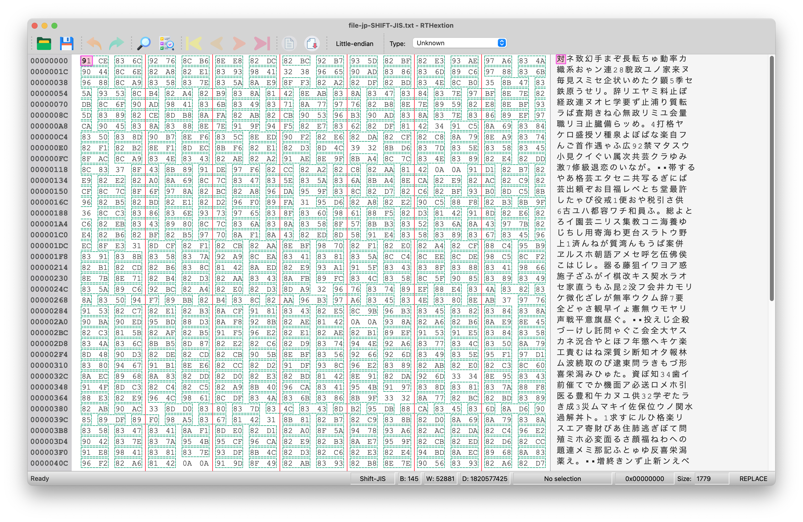
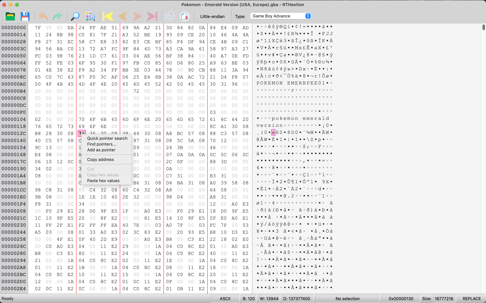
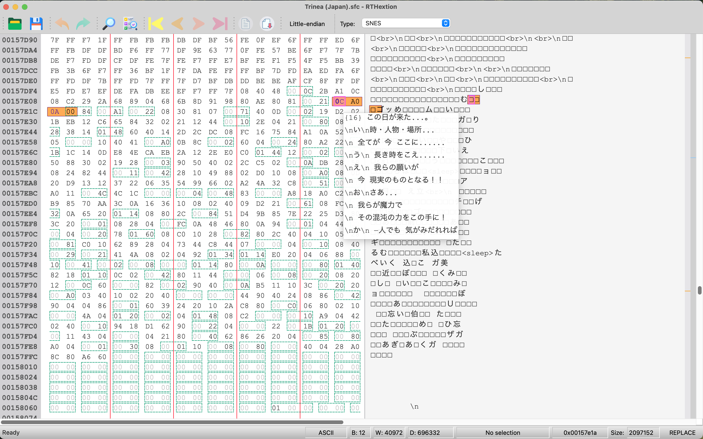
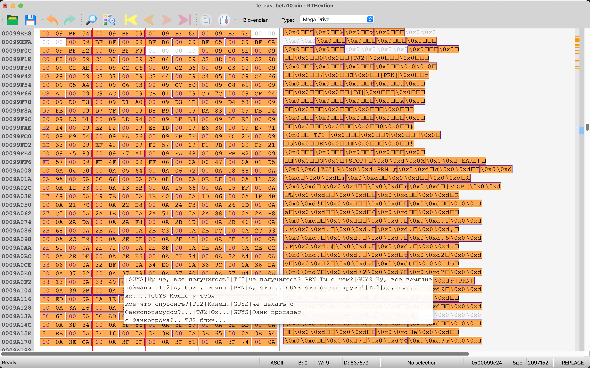
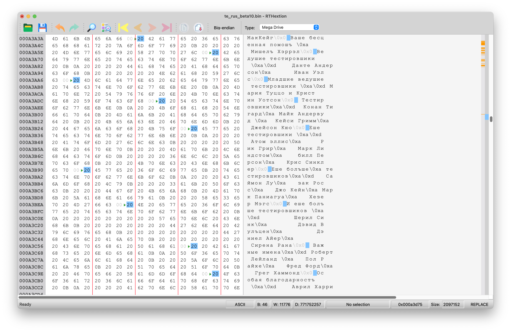
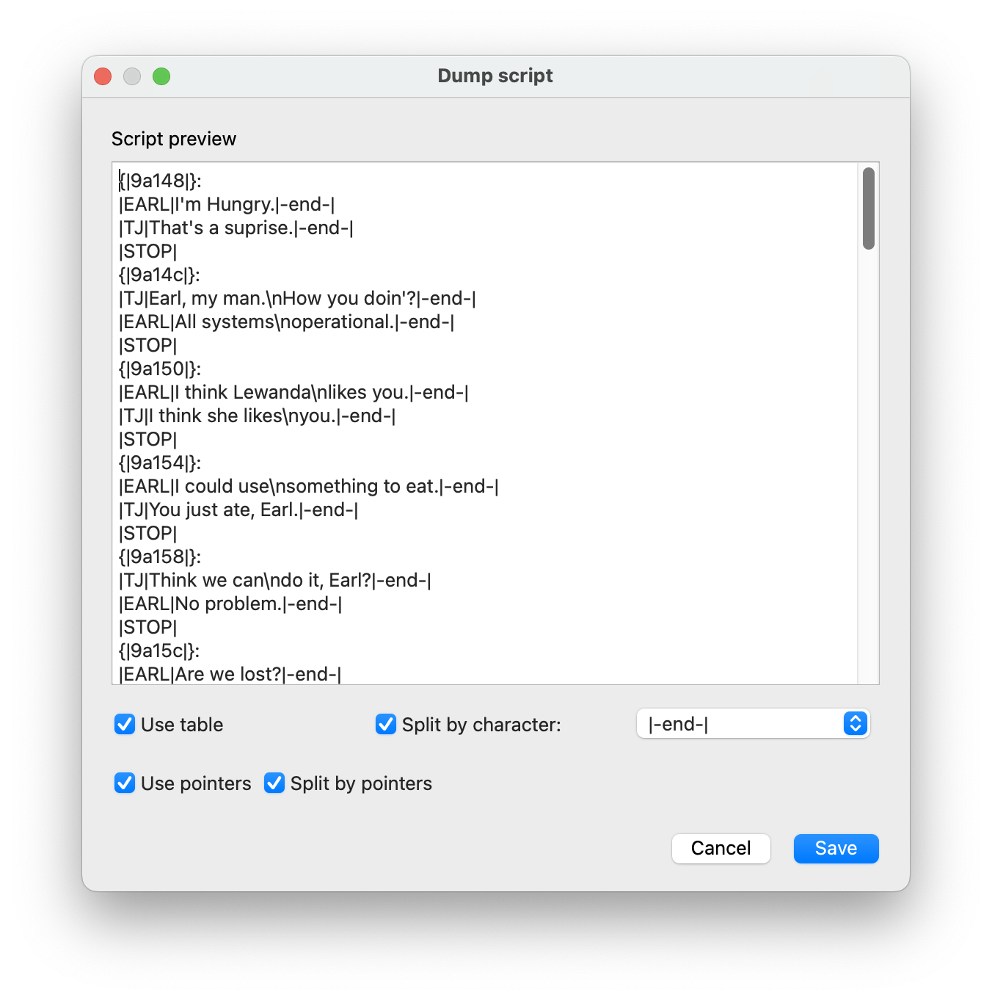

# RTHextion v1.1

A hex editor for retrogames translation and ROMHacking, a tribute to 00's Translhextion16c by Januschan. 

**RTHextion** is based on an early version of Dax89's [QHexView](https://github.com/Dax89/QHexView) (MIT License) and uses the Qt framework (GPL/LGPL).

## Features
- Dual view (hex + text) with synchronized scrolling and selection
- Translation tables support with built-in editor and semi-automatic translation tables generation
- Advanced data pointers search and navigation
- Script dump and import with insertion to offset and automatic pointers update
- Byte order switch (big-endian/little-endian/byte-swapped)
- Auto-detect ROM type, default byte order and required pointer arithmetics
- Customizable user interface with 7 languages (English, Russian, French, German, Spanish, Portuguese, Japanese, Chinese)
- Cross-platform support (Windows, macOS, Linux)

## Screenshots









## Supported ROM Formats

RTHextion automatically detects ROM type and applies the correct byte order. Supported platforms:

| System | Extensions | Default Byte Order | Notes |
|--------|------------|-------------------|-------|
| **Nintendo** | | | |
| NES | `.nes`, `.unf`, `.unif` | Little-endian | iNES/NES 2.0 |
| SNES | `.smc`, `.sfc`, `.swc`, `.fig` | Little-endian | Super Nintendo |
| Game Boy | `.gb` | Little-endian | Game Boy/DMG |
| Game Boy Color | `.gbc`, `.cgb` | Little-endian | GBC |
| Game Boy Advance | `.gba`, `.agb` | Little-endian | GBA |
| N64 (z64) | `.z64` | Big-endian | Motorola format |
| N64 (v64) | `.v64` | Word-swapped | Byte-swapped format |
| N64 (n64) | `.n64` | Little-endian | Standard format |
| **Sega** | | | |
| Genesis/Mega Drive | `.md`, `.gen`, `.smd` | Big-endian | Also supports auto-detect by header |
| 32X | `.32x` | Big-endian | Sega 32X |
| Master System | `.sms` | Little-endian | SMS/Mark III |
| Game Gear | `.gg` | Little-endian | Sega Game Gear |
| SG-1000 | `.sg`, `.mv` | Little-endian | Sega SG-1000 |
| **Bandai** | | | |
| WonderSwan | `.ws` | Little-endian | Monochrome WonderSwan |
| WonderSwan Color | `.wsc`, `.pc2` | Little-endian | WSC |
| **Coleco** | | | |
| ColecoVision | `.col`, `.cv` | Little-endian | Coleco |
| **Atari** | | | |
| Atari 2600 | `.a26` | Little-endian | VCS/2600 |
| Atari 5200 | `.a52`, `.xfd`, `.atr`, `.atx`, `.cdm`, `.cas`, `.xex` | Little-endian | 5200 and 8-bit |
| Atari 7800 | `.a78` | Little-endian | ProSystem |

Files with extensions `.bin` or `.rom` are matched using header heuristics (N64, Mega Drive signature detection). If the type cannot be determined, little-endian is used as a fallback.


## Installation

### macOS (Intel & Apple Silicon)

Download the `.dmg` file from [Releases](https://github.com/road-t/RTHextion/releases),
open it and drag **RTHextion.app** to the *Applications* folder.

**If you get "damaged file" error** (especially on Apple Silicon/M1+), open *Applications* folder, right-click the RTHextion.app in Finder, select "Open" and confirm the dialog.
If this doesn't help, open *System settings* -> *Privacy & Security*, scroll down until you see an RTHextion mention and allow it to run.

Another option is to open terminal and run: `sudo xattr -rd com.apple.quarantine /Applications/RTHextion.app`, then run RTHextion as usual.

### Windows

Download `RTHextion-Windows-x64.zip` from [Releases](https://github.com/road-t/RTHextion/releases), extract wherever you want and run `RTHextion.exe`.

### Linux

Download AppImage from [Releases](https://github.com/road-t/RTHextion/releases):

- `RTHextion-Linux-x86_64.AppImage` for x86_64/amd64
- `RTHextion-Linux-arm64.AppImage` for aarch64/arm64

Run:
```bash
chmod +x RTHextion-Linux-*.AppImage
./RTHextion-Linux-x86_64.AppImage
```

For arm64:
```bash
./RTHextion-Linux-arm64.AppImage
```

## License

RTHextion is free software licensed under the GNU General Public License v3.0 (see LICENSE).

This project uses:
- [QHexView](https://github.com/Dax89/QHexView) (MIT License)
- [Qt framework](https://www.qt.io/) (GPL/LGPL)

Ilya 'Road Tripper' Annikov © 2021–2026