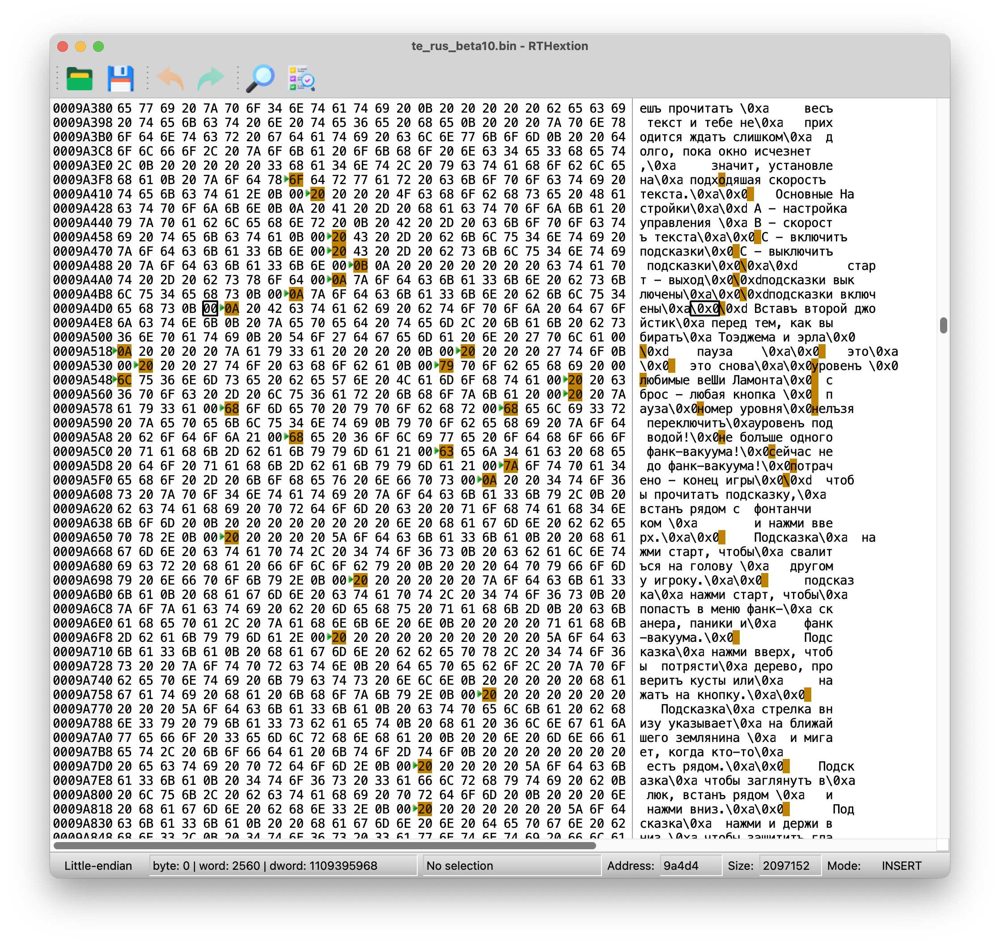
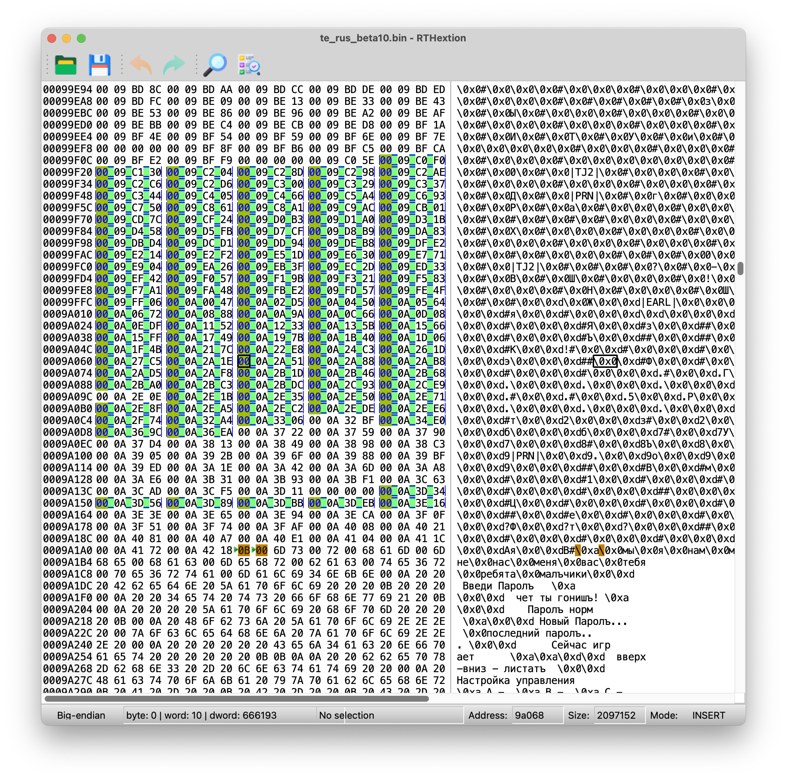
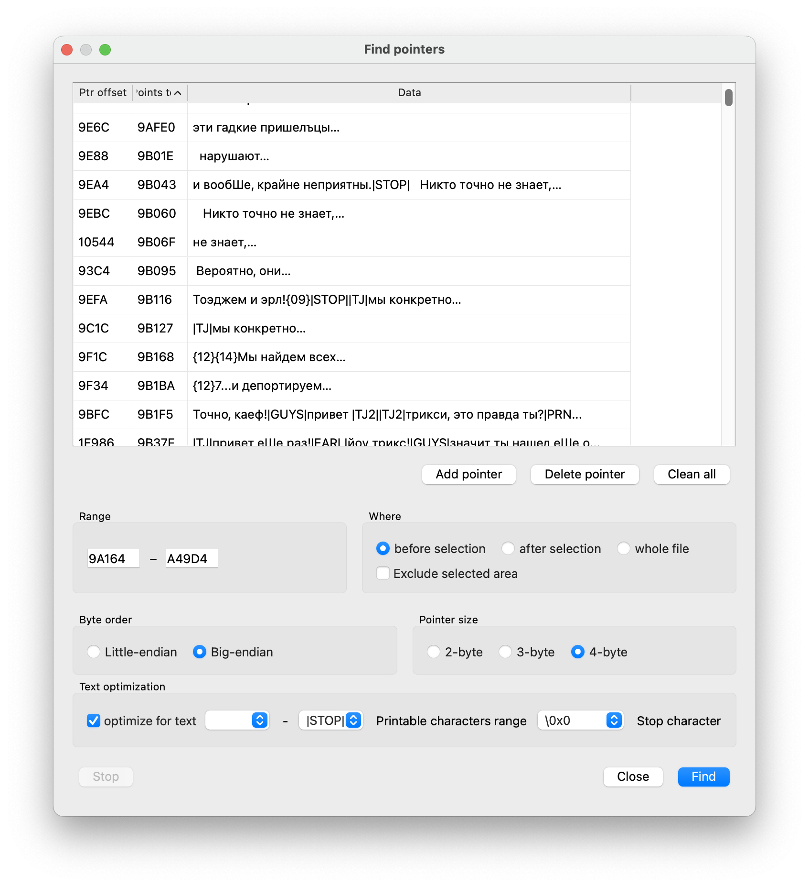

# RTHextion v0.9

A hex editor for retrogames translation and ROMHacking, a tribute to 00's Translhextion by Januschan. 

**RTHextion** is based on an early version of Dax89's [QHexView](https://github.com/Dax89/QHexView) (MIT License) and uses the Qt framework (GPL/LGPL).

## Features
- Dual view (hex + text) with synchronized scrolling and selection
- Translation tables support
- Built-in editor
- Semi-automatic translation tables generation
- Most advanced data pointers search and navigation
- Script dump and import with insertion to offset and automatic pointers update
- Byte order switch (big-endian/little-endian)






## Installation

### macOS (Intel & Apple Silicon)

Download the `.dmg` file from [Releases](https://github.com/road-t/RTHextion/releases),
open it and drag **RTHextion.app** to the *Applications* folder.

**If you get "damaged file" error** (especially on Apple Silicon/M1+), open *Applications* folder, right-click the RTHextion.app in Finder, select "Open" and confirm the dialog.
If this doesn't help, open *System settings* -> *Privacy & Security*, scroll down until you see an RTHextion mention and allow it to run.

Another option is to open terminal and run: `sudo xattr -rd com.apple.quarantine /Applications/RTHextion.app`, then run RTHextion as usual.

### Windows

Download `RTHextion-Windows-x64.zip` from [Releases](https://github.com/road-t/RTHextion/releases), extract wherever you want and run `RTHextion.exe`.

### Linux

Download AppImage from [Releases](https://github.com/road-t/RTHextion/releases):

- `RTHextion-Linux-x86_64.AppImage` for x86_64/amd64
- `RTHextion-Linux-arm64.AppImage` for aarch64/arm64

Run:
```bash
chmod +x RTHextion-Linux-*.AppImage
./RTHextion-Linux-x86_64.AppImage
```

For arm64:
```bash
./RTHextion-Linux-arm64.AppImage
```

## License

RTHextion is free software licensed under the GNU General Public License v3.0 (see LICENSE).

This project uses:
- [QHexView](https://github.com/Dax89/QHexView) (MIT License)
- [Qt framework](https://www.qt.io/) (GPL/LGPL)

Ilya 'Road Tripper' Annikov © 2021–2026