# RTHextion v3.0-alpha - Retrogames Translation Hex Editor

A powerful hex-editor for retrogames translation and ROMHacking. 
Inspired by the original Translhextion editor created by [Brian 'Januschan' Bennewitz]( https://github.com/JanusMael) in early 2000's, RTHextion is a modern, cross-platform tool with a wide range of features for efficient and safe ROM editing and translation projects.

## Features
- Translation projects support:
  - Multiple tables support
  - Integrated disassembly with multiple CPU support
  - Tile Graphics display and editing
  - Audio display, playback and import/export
  - Pointers list
  - Original data import/preservation for safe editing and comparison
  - IPS patch generation and import
  - Quick original content view
  - Sections with separate view type and groupping
- **Multi-tab workspace** with persistent session — open multiple files/projects simultaneously, all tabs and their state saved and restored on restart
- Dock widgets for convenient workflow:
  - **Sections dock** — organize file structure with nested sections, auto-highlight current section by cursor position, full drag-drop support
  - **Pointers dock** — search data pointers and navigate to referenced locations with real-time preview
  - **Translation tables dock** — view, edit, and switch between translation tables without leaving the editor
  - **Changes dock** — track all modifications to the current file
  - **Graphics dock** — preview and edit tile graphics with palette-aware rendering and direct drawing tools
  - **Palette dock** — detect, view and edit color palettes directly in the hex editor with multiple format support and auto-detection
  - **Audio dock** — preview supported audio sections directly inside the app
- **Integrated disassembly** with raw/code views, function detection, and section-aware code/data rendering
- Translation tables support with built-in editor and semi-automatic translation tables generation
- Advanced data pointers search and navigation
- Script dump and import with insertion to offset and automatic pointers update; IPS patch generation and import
- Empty file editing — click to create the first byte and immediately start typing
- Byte order switch (big-endian/little-endian/byte-swapped)
- Auto-detect ROM type, default byte order and required pointer arithmetics
- Customizable user interface with 7 languages (English, Russian, French, German, Spanish, Portuguese, Japanese, Chinese)
- UI theme support (light/dark) with customizable colors and fonts
- Sections hierarchical organization with colored highlighting 
- Virtual format support with automatic line breaks around sections
- Cross-platform support (Windows, macOS, Linux)

## Screenshots

#### Changes storage and highlighting
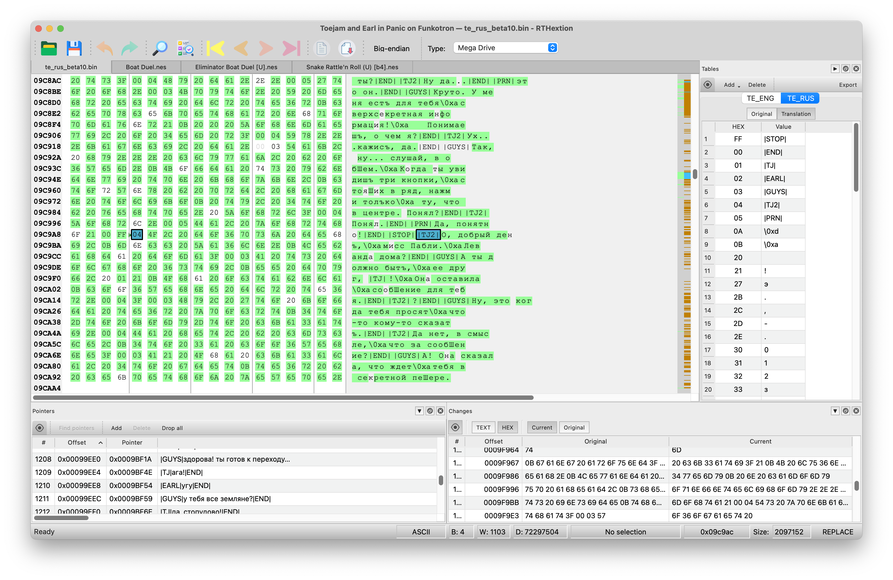

#### Virtual formatting for structured data visualization and editing
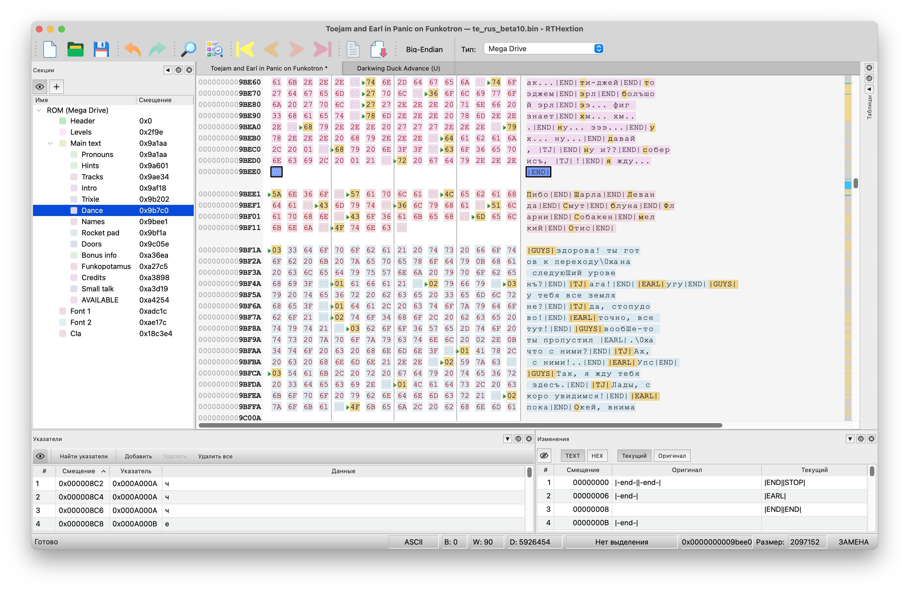

#### Tile graphics display and editing
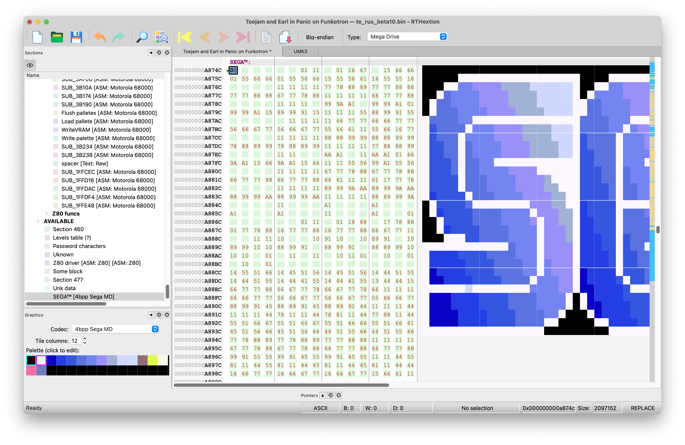

#### Audio decoding with import/export support
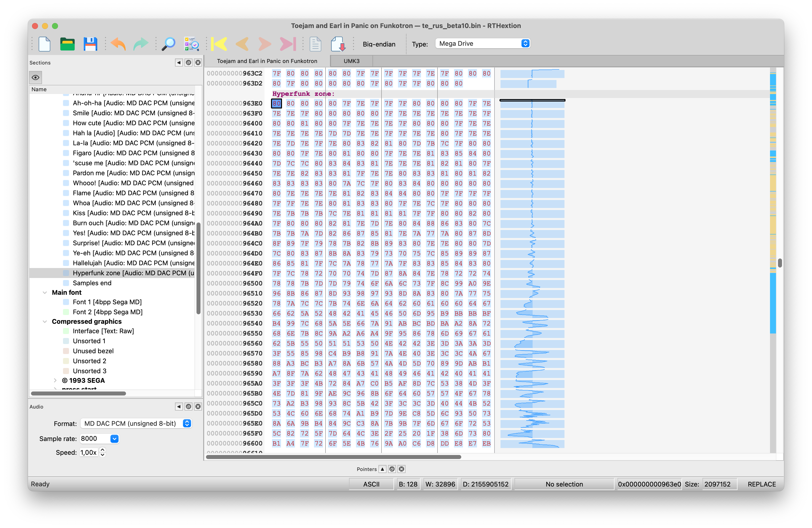

#### Disassembly view with navigation and pointer detection
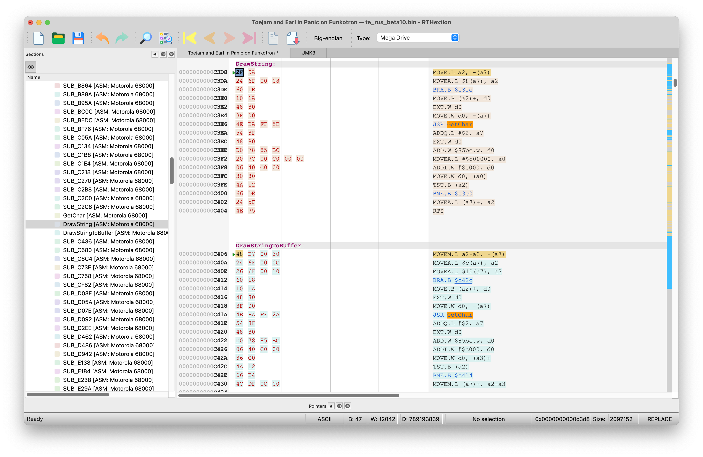

#### Pointers search and navigation with real-time preview and highlighting
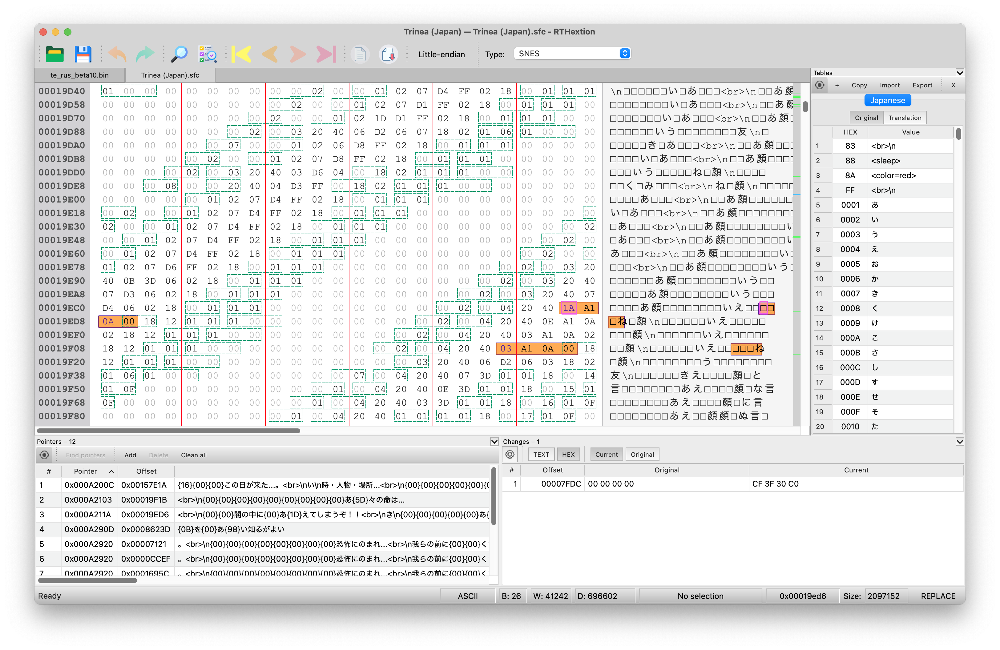

#### Multimodal find/replace with text/hex/table mode and relative search
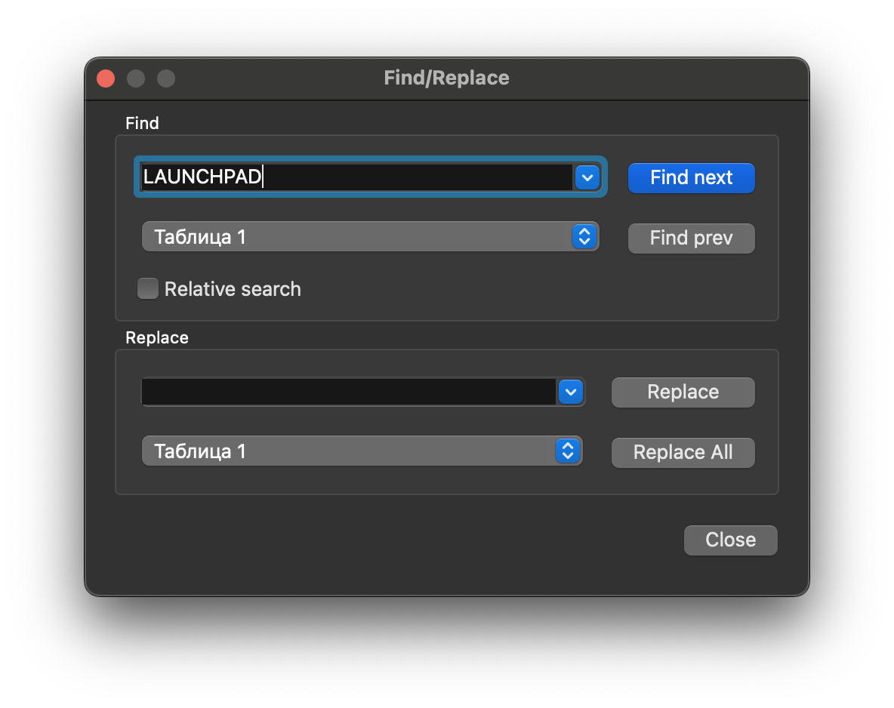

#### Automatic pointers search with various pointer types and heuristics, real-time preview and highlighting of found pointers, and navigation to referenced locations
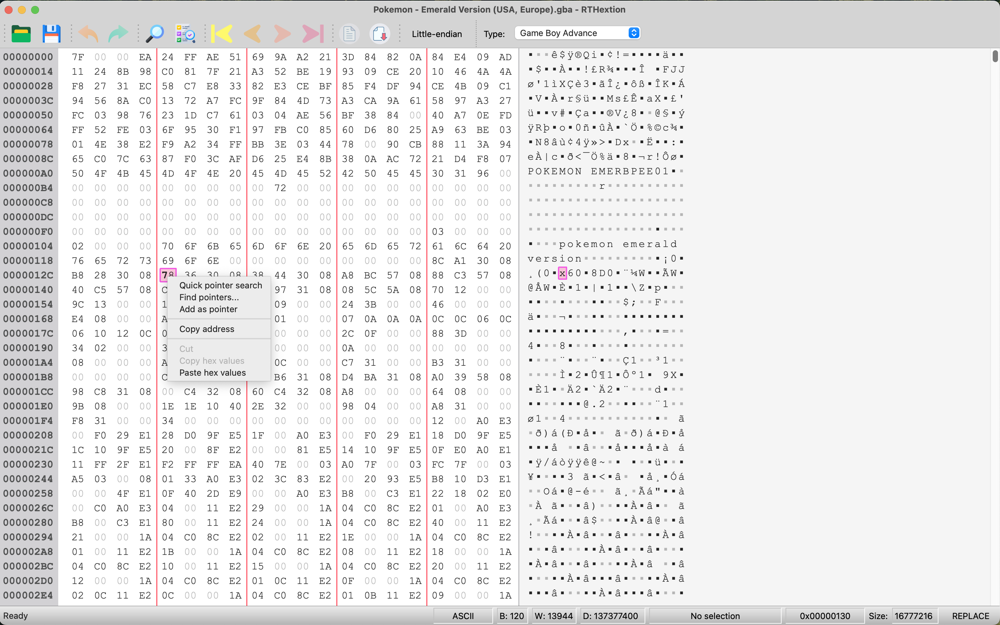

#### Multibyte characters support and highlighting
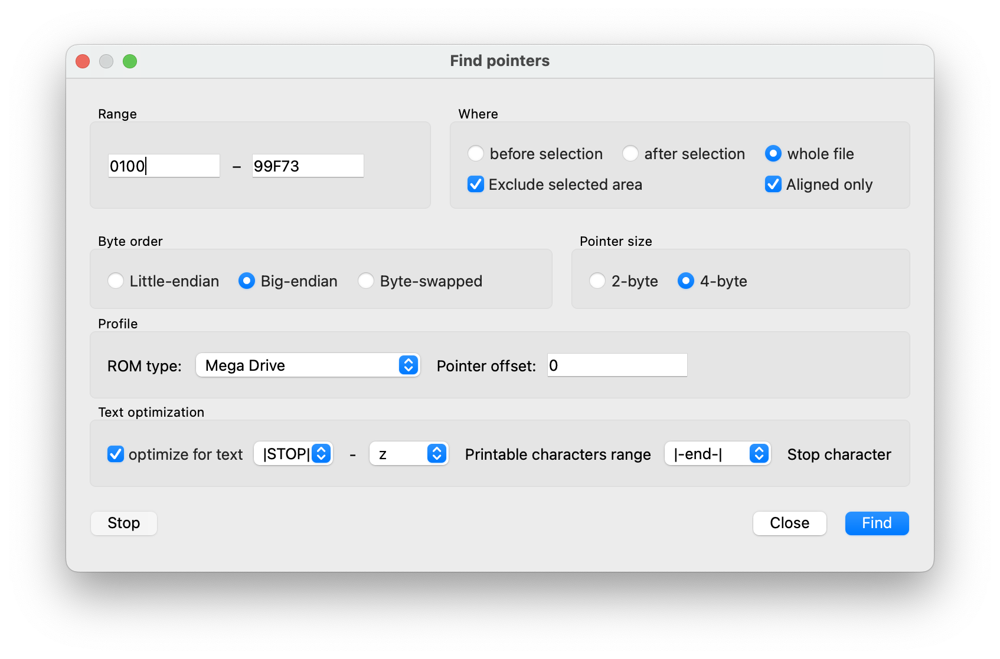

#### Pointers hints in the hex view with referenced data preview
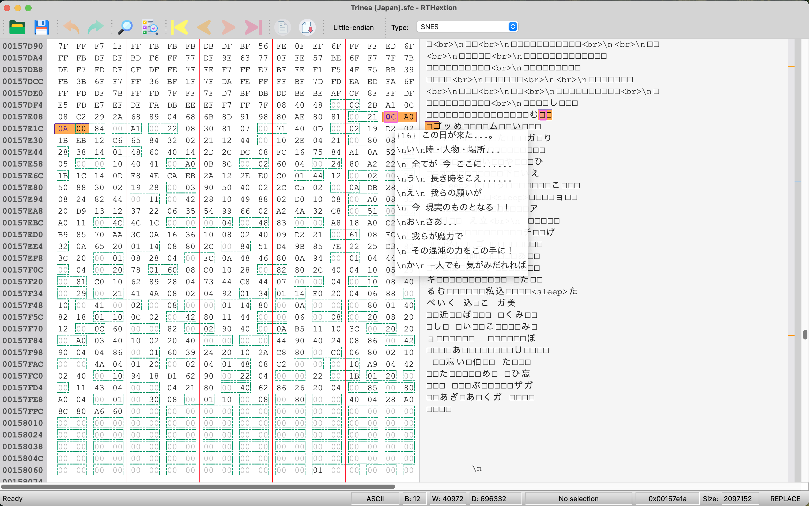
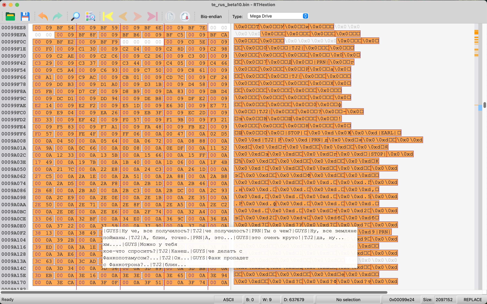

#### Data offsets with found pointers
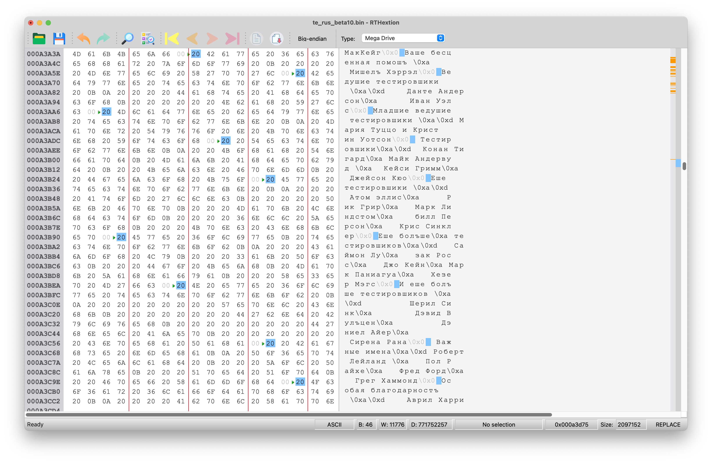

#### Script dump and in-place editing with automatic pointers update and table support
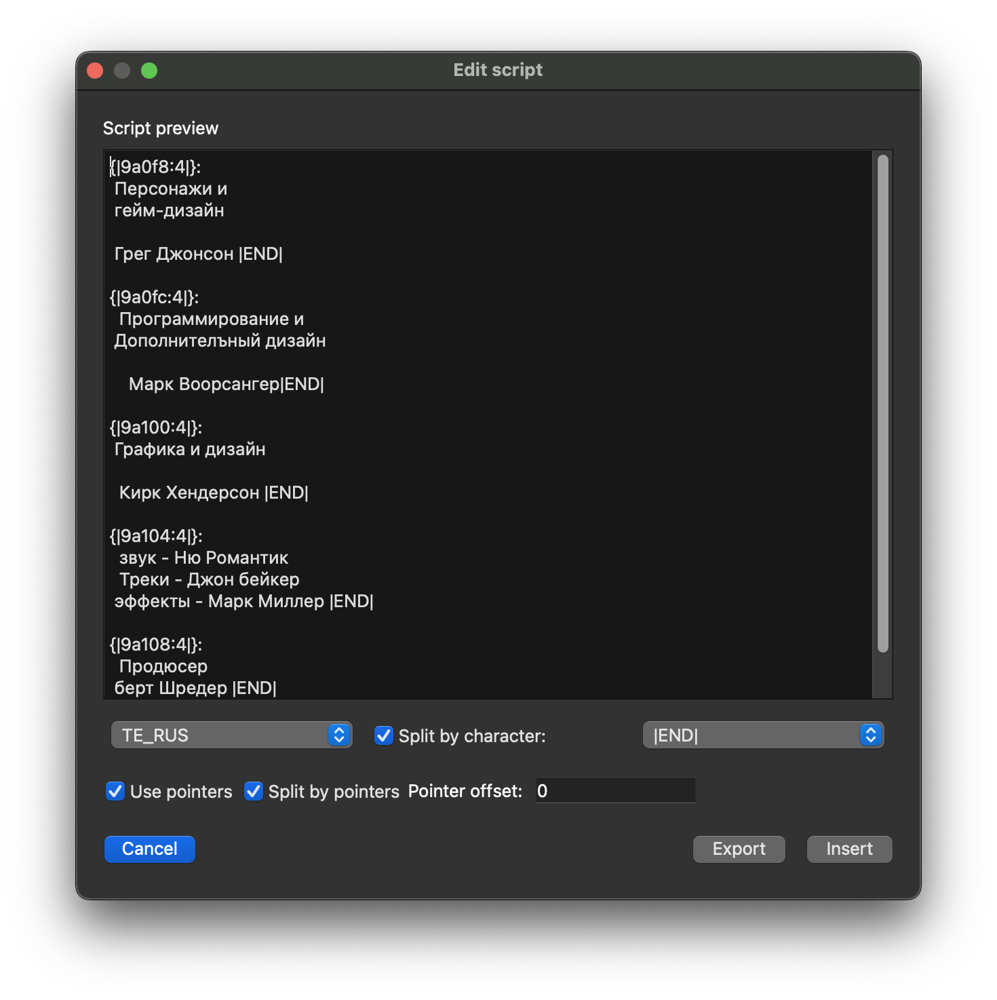

## Supported ROM Formats

RTHextion automatically detects ROM type and applies the correct byte order. Supported platforms:

| System | Extensions | Default Byte Order | Notes |
|--------|------------|-------------------|-------|
| **Nintendo** | | | |
| NES | `.nes`, `.unf`, `.unif` | Little-endian | iNES/NES 2.0 |
| SNES | `.smc`, `.sfc`, `.swc`, `.fig` | Little-endian | Super Nintendo |
| Game Boy | `.gb` | Little-endian | Game Boy/DMG |
| Game Boy Color | `.gbc`, `.cgb` | Little-endian | GBC |
| Game Boy Advance | `.gba`, `.agb` | Little-endian | GBA |
| N64 (z64) | `.z64` | Big-endian | Motorola format |
| N64 (v64) | `.v64` | Word-swapped | Byte-swapped format |
| N64 (n64) | `.n64` | Little-endian | Standard format |
| **Sega** | | | |
| Genesis/Mega Drive | `.md`, `.gen`, `.smd` | Big-endian | Also supports auto-detect by header |
| 32X | `.32x` | Big-endian | Sega 32X |
| Master System | `.sms` | Little-endian | SMS/Mark III |
| Game Gear | `.gg` | Little-endian | Sega Game Gear |
| SG-1000 | `.sg`, `.mv` | Little-endian | Sega SG-1000 |
| **Bandai** | | | |
| WonderSwan | `.ws` | Little-endian | Monochrome WonderSwan |
| WonderSwan Color | `.wsc`, `.pc2` | Little-endian | WSC |
| **Coleco** | | | |
| ColecoVision | `.col`, `.cv` | Little-endian | Coleco |
| **Atari** | | | |
| Atari 2600 | `.a26` | Little-endian | VCS/2600 |
| Atari 5200 | `.a52`, `.xfd`, `.atr`, `.atx`, `.cdm`, `.cas`, `.xex` | Little-endian | 5200 and 8-bit |
| Atari 7800 | `.a78` | Little-endian | ProSystem |

Files with extensions `.bin` or `.rom` are matched using header heuristics (N64, Mega Drive signature detection). If the type cannot be determined, little-endian is used as a fallback.


## Installation

### macOS (Intel & Apple Silicon)

Download the `.dmg` file from [Releases](https://github.com/road-t/RTHextion/releases),
open it and drag **RTHextion.app** to the *Applications* folder.

**If you get "damaged file" error** (especially on Apple Silicon/M1+), open *Applications* folder, right-click the RTHextion.app in Finder, select "Open" and confirm the dialog.
If this doesn't help, open *System settings* -> *Privacy & Security*, scroll down until you see an RTHextion mention and allow it to run.

Another option is to open terminal and run: `sudo xattr -rd com.apple.quarantine /Applications/RTHextion.app`, then run RTHextion as usual.

### Windows

Download `RTHextion-Windows-x64.zip` from [Releases](https://github.com/road-t/RTHextion/releases), extract wherever you want and run `RTHextion.exe`.

### Linux

Download AppImage from [Releases](https://github.com/road-t/RTHextion/releases):

- `RTHextion-Linux-x86_64.AppImage` for x86_64/amd64
- `RTHextion-Linux-arm64.AppImage` for aarch64/arm64

Run:
```bash
chmod +x RTHextion-Linux-*.AppImage
./RTHextion-Linux-x86_64.AppImage
```

For arm64:
```bash
./RTHextion-Linux-arm64.AppImage
```

## License

RTHextion is free software licensed under the GNU General Public License v3.0 (see LICENSE).

**RTHextion** uses some code from early version of Dax89's [QHexView](https://github.com/Dax89/QHexView) (MIT License) and uses the Qt framework (GPL/LGPL).

This project uses:
- [QHexView](https://github.com/Dax89/QHexView) (MIT License)
- [Qt framework](https://www.qt.io/) (GPL/LGPL)

Ilya 'Road Tripper' Annikov © 2021–2026