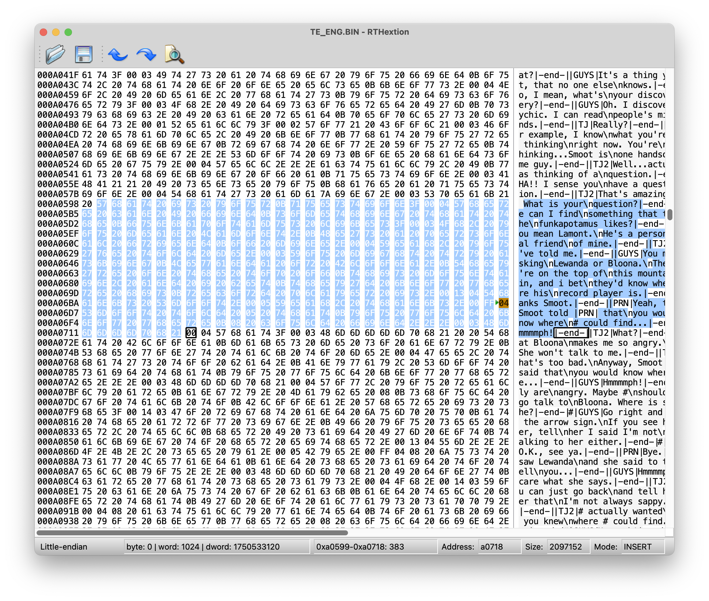
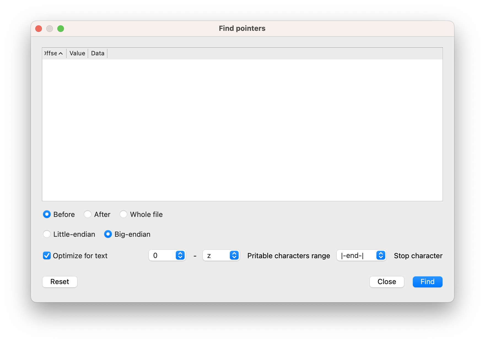

# RTHextion

Hex editor for ROMHacking, a tribute to 00's Translhextion from Januschan based on Dax89's [QHexView](https://github.com/Dax89/QHexView).

**RTHextion** supports tables, pointers search, dump export/import (with automatic pointers update).

**N.B.:** The software is under development, some features can be glitchy. For instance, pointers list display is broken.

*Fixes are welcome)*
